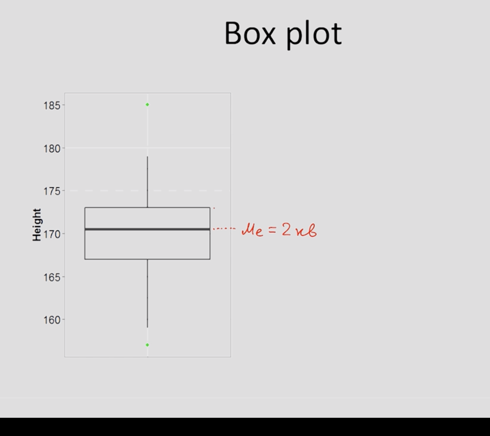

# Статистика. Заметки

Created By: Alex Nikolskii
Last Edited: Oct 06, 2019 4:53 PM
Tags: Stats

# Введение

## Базовые определения:

- **Генеральная совокупность** — множество всех объектов, относительно которых мы хотим делать какие-либо выводы в рамках какого-либо исследования.

Так как генеральные совокупности могут быть чересчур огромными, мы хотим выбрать такие элементы, которые обладают свойствами генеральной совокупности:
- **Выборка** — набор объектов из генеральной совокупности, который обладает исследуемыми нами характеристиками(свойствами) генеральной совокупности. 

То есть это как пример с уроками литературы у Михайловой: по прочитанному за пять минут части текста пытаемся экстраполировать(обобщить) на все произведение.
- **Репрезентативность (выборки)** — свойство быть моделью генеральной совокупности, отражать свойства генеральной совокупности.

Пример:
Если мы провели исследование с целью выявить уровень знаний в области биологии на 100 студентах биологического факультета СПбГУ, то на какую совокупность мы можем распространить наши выводы?

Мужчины и женщины в возрасте от 18 до 22 лет

Студенты СПБГУ

**Студенты биологического факультета СПБГУ**

****Не понял(а), почему это так? ⇒ перечитай определения.

## **Как получить репрезентативную выборку?**

Есть следующие способы формирования репрезентативной выборки:

1. Простая случайная выборка(simple random sample) — рандомом выбираем элементы из генеральной совокупности, которые попадут к нам в выборку.

2. Стратифицированная выборка(statified sample) — сначала разбиваем нашу генеральную совокупность на несколько **обособленных и различных по своей природе** групп(страт), потом из каждой страты выбираем случайный элемент. 

3. Групповая выборка(cluster sample) — сначала разбиваем генеральную совокупность на несколько **очень сильно похожих между собой** групп(кластеров), потом просто выбираем несколько кластеров, и с помощью метода 1 (Простая случайная выборка), получаем репрезентативную выборку.

## Типы переменных

Мы формируем выборку не просто так, нас интересуют **некоторые характеристики генеральной совокупности**, которые мы хотим исследовать.

В статистике используются следующие типы переменных:

- Количественные — представляют собой **непосредственно измеренные** значения признака(характеристики, свойства).
    - Непрерывные

    Пример: рост человека. Допустим, что мы исследуем людей с ростом в отрезке [160, 190] сантиметров. Если у нас есть значение 164.3, то это непрерывная случайная величина — тупой критерий, пока что понял так
    - Дискретные — переменные принимают только определенные значения. Пример: количество детей в семье — 3.5 ребенка в семье быть не может.

- Качественные(Номинативные) — используются **для разделения** наших испытуемых **на группы**. 
Пример: обозначим через 1 испытуемых женского пола, через 2 испытуемых мужского пола. 

В случае номинативных переменных за цифрами **не стоит никакого математического смысла**. Эти цифры — маркеры(лэйблы)
- Ранговые — переменные, которые мы можем сравнивать.

Пример: у нас есть марафонский забег. Кто-то пришел первым, кто-то вторым и так далее...
Мы можем сказать, что первый испытуемый пришел раньше пятого, однако мы не можем измерить преимущество первого над пятым. 

Единственная математическая операция, возможная в случае ранговых переменных — **сравнение**.

Можно переводить переменные из одного вида в другой:
Измерим рост испытуемых(непрерывная количественная переменная), проранжировать их(Ранговая переменная), затем поделить на две группы — выше среднего и ниже среднего(Номинативная переменная).

В обратную сторону мб и нельзя, пока что не осознал.

## Форма распределения переменных

Опр. **Гистограмма частот** — график, который позволяет нам сделать сделать первое впечатление о распределении нашего количественного признака.
С помощью гистограммы мы можем посмотреть как часто значение этой переменной встречается на определенном промежутке.

Предположение: гистограмма частостей является статистическим аналогом плотности распределения какой-либо случайной величины.

Википедия:
Опр. **Гистограмма** — функция, приближающая плотность вероятности некоторого распределения, построенная на основе выборки из него.

Для того, чтобы исследовать распределение некоторой переменной, мы познакомимся с **двумя типами описательных статистик:** 

1. **Меры центральной тенденции** — позволяет ответить на вопрос: на сколько высокие значения принимает наша переменная.
2. **Меры изменчивости** — позволяет делать выводы о вариативности нашего признака.

### Меры центральной тенденции:

Для чего нужны: представим, что у нас есть 1000 значений какой-либо переменной, а нас просят описать эти значения **одним числом**, которое максимально хорошо описывает получившееся распределение. 

Как это сделать и какое значение признака нам выбрать?

1. **Мода**(Mode)— значение измеряемого признака, которое встречается **максимально часто**. 
Если у вас несколько мод, то все эти числа характеризуют распределение. Просят одно? Выбирай любую моду.

2. **Медиана**(Median) — значение признака, которое делит **упорядоченное множество** данных пополам(с точки зрения количества элементов).

Если нечетное количество элементов в выборке — значение по середине ряда будет нашей медианой. 

Если четное количество элементов — берем два значения по центру(ровно в середине) и считаем их среднее арифметическое.

3. **Среднее значение**(Mean, среднее арифметическое) — сумма всех значений измеренного признака, деленная на количество измеренных значений.

Среднее значение выборки для **не сгруппированных данных** : 

$${\bar  {X}}={\frac  {1}{n}}\sum \limits _{{i=1}}^{n}X_{i}.$$

Среднее значение генеральной совокупности: 

$${\mu}$$

Зачем нам 3 меры центральной тенденции? Т.к. есть плохие штуки — выбросы, наличие нескольких мод, мы не можем использовать среднее значение везде где только можно. 

Поэтому, если наше распределение:

- **симметрично**(пока не придумал как тут это объяснить. Сейчас для себя я это представляю как колокол нормального распределения. Если он целый колокол, то все збс, если часть колокола, то распределение не симметрично)
- **Унимодально**(только одна мода)
- **Не имеет заметных выбросов**

то можем использовать **любую меру** из мер центральной тенденции.

Однако, если: все следующие пункты через **либо**

- **Распределение ассиметрично** — скошено в какую-либо сторону
- **Заметные выбросы**
- **Наличие нескольких мод**

то выбор среднего значения в качестве может дать некорректные результаты. В данном случае лучше использовать **моду** или **медиану** для того, чтобы охарактеризовать наши данные с точки зрения **степени выраженности** некоторого количественного признака.

### Меры изменчивости:

1. **Размах**(Range) — разность между максимальным и минимальным значением нашей выборки. Такая себе мера — сильно изменяется с наличием выбросов.

    Как рассчитать изменчивость данных, используя каждое значение выборки? Тут нам на помощь приходит дисперсия.

2. **Дисперсия**(variance) — средний квадрат отклонений индивидуальных значений признака от их средней величины. 

Другими словами(вдруг станет понятнее) — насколько в среднем наши значения отклоняются от среднего значения по выборке.

    Формула дисперсии для **Генеральной совокупности:**

    $$D = \frac{\sum_{i=1}^{n}(x_{i} - \bar{x})^2}{n}$$

    Формула дисперсии для **Некоторой Выборки:** 

    $$D = \frac{\sum_{i=1}^{n}(x_{i} - \bar{x})^2}{n - 1}$$

    Почему вычитаем -1 в знаменателе? 

    Это связано с понятием **Степеней Свободы.** Пока что считаем это магией.

    Формула среднего квадратического отклонения:

    $$\sigma = \sqrt{D}$$

    Именно среднее квадратическое отклонение показывает реальное среднее значение наших отклонений от среднего по выборке.

    **Важный момент:**

    - Стандартное отклонение для *Генеральной совокупности* обозначается

        $$\sigma$$

    - Стандартное отклонение для *Некоторой Выборки* обозначается через: **sd** (standart deviation)

    **Свойства Дисперсии(**Вдруг кто-то забыл, а тебя собираются спросить на экзамене**):** 

    $$D_{x+c} = D_{x}$$

    $$sd_{x+c} = sd_{x}$$

    $$D_{x*c} = D_{x} * c ^ 2$$

    $$sd_{x*c} = sd_{x} * c$$

    Хочешь понять, почему это так? Смотри тут:

    [Меры изменчивости](https://stepik.org/lesson/8076/step/9?unit=1356)

### Квантили распределения:

Опр. **Квантиль распределения** — такие значения признака, которые делят упорядоченные данные на несколько равных частей. 
Пример — медиана.

Опр. **Квартиль распределения** — 3 таких значения признака, которые делят упорядоченные данные на 4 равные части по количеству элементов выборки. (Разница определений в одной букве — это не ошибка)

**Box Plot(ящик с усами):**

Обозначения элементов на графике:

**Жирная линия** — Медиана

**Верхняя сторона ящика** — третий квартиль данных

**Нижняя сторона ящика** — первый квартиль данных

**Межквартильный размах** — разница между первым и третьим квартилем данных.

**Границы усов** — значения, которые входят в **1,5 межквартельных размаха** от верхней стороны ящика вверх и от нижней стороны ящика вниз соответственно.

Все, что дальше **1.5 межквартельного размаха** называется **выбросами.**

*Используется для сравнения двух групп между собой.*

## Нормальное распределение

